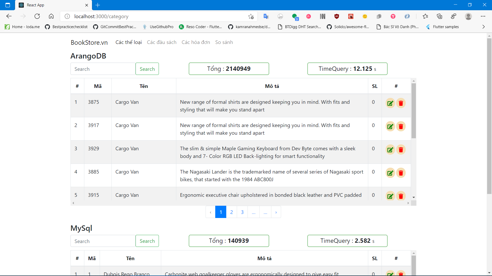
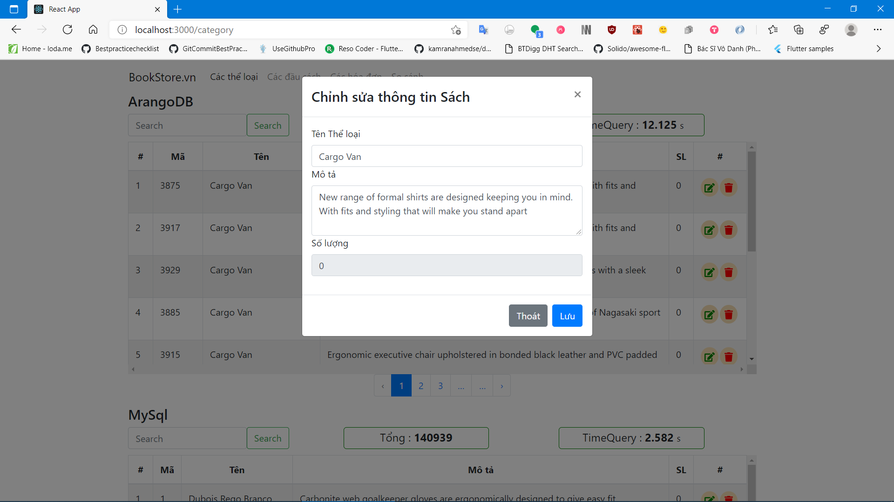
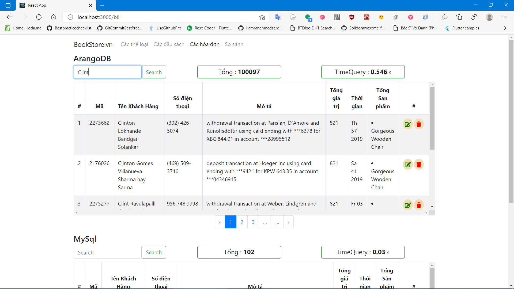
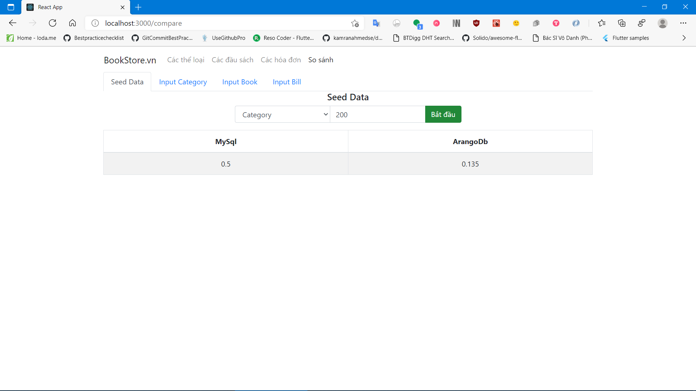
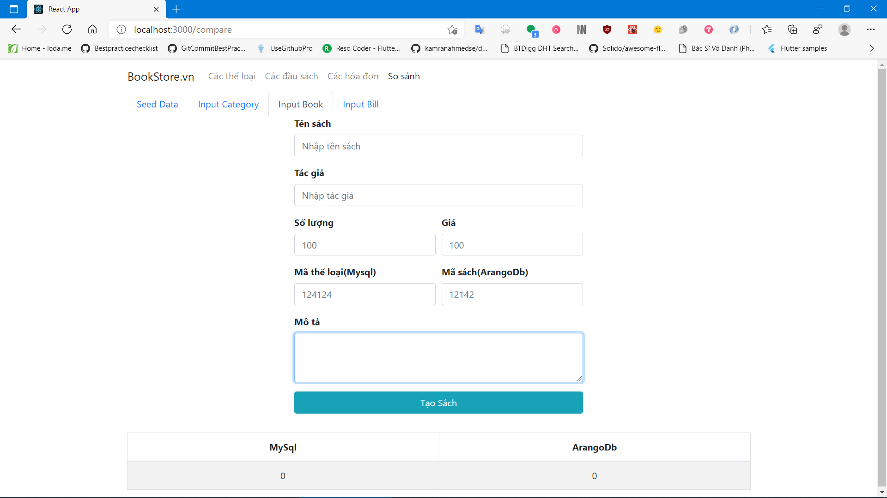

# ArangoDB 🥑
> Source code for Database Management Project: Researching ArangoDB and Comparing with MySQL.

## Group 15
**Team Member:**
- Nguyen Thai Tiep - 18021277
- Hoang Trung Phong - 18020998
- Nguyen Duy Kien - 18020074

## Requirement
* [NodeJs and npm](https://nodejs.org/en/)
* [MySQL](https://dev.mysql.com/downloads/)
* [ArangoDB](https://www.arangodb.com/download/)

## Installation
Navigate and config into each file in sub-directory:
> server/.env

> servermysql/ormconfig.json

with Database username and password.

Terminal/Bash/CMD:
In each directory
* client
* server
* mysqlserver
```
MyProject
├── .gitignore       // Standard gitignore file
├── client           // Client dir
├── server           // ArangoDB server
├── mysqlserver      // MySQL server
└── README.md        // README file
```
Install dependencies
```sh
npm install
```
Start project
```sh
npm start
```

## Usage example
- This is a project which demonstrate our research about ArangoDB - a new generation type of Entity Relationship Model Database Management (ERM-DB) and comparing it with MySQL.
* Project using:
   * NodeJS + NodeTS
   * ReactTS
   * Orango 🍊
   * TypeORM
   
- Demo







## Release History

* 1.0.0
    * The first proper release
    * FIX: Crash when run.
* 0.0.1
    * Work in progress

## Meta

Hoang Trung Phong – [Facebook](https://www.facebook.com/kaka.phong.2a63/) – phong2a63@gmail.com

Distributed under the MIT license. See ``LICENSE`` for more information.

[https://github.com/phonghoang2k](https://github.com/phonghoang2k)

## Contributing

1. Fork it (<https://github.com/phonghoang2k/chatbot-uet/fork>)
2. Create your feature branch (`git checkout -b feature/fooBar`)
3. Commit your changes (`git commit -am 'Add some fooBar'`)
4. Push to the branch (`git push origin feature/fooBar`)
5. Create a new Pull Request

<!-- Markdown link & img dfn's -->
[npm-image]: https://img.shields.io/npm/v/npm
